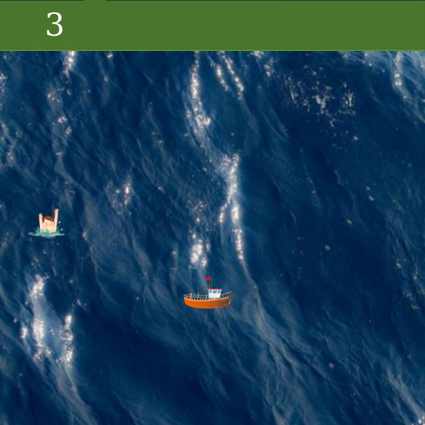

# Introduction!

Vous avez un bateau qui voyage sur la mer. Votre travail consiste à sauver des vies humaines en vous dirigeant vers elles à l'aide des touches gauche, droite, haut et bas.

 
## Comment jouer

aller vers le lien : https://khaliljedda.github.io/nuit-info-v2/ et jouer en ligne
Naviguez à gauche, à droite, en haut et en bas pour sauver des vies d'une mort certaine.